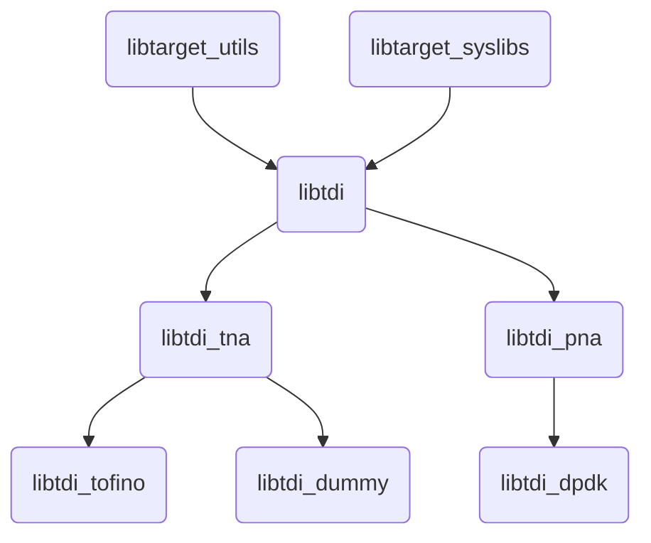

# TDI
## Introduction

TDI (Table Driven Interface) is a Target Abstraction Interface. It is a set of APIs that enable configuration and management of programmable P4 and fixed functions of a backend device in a uniform and dynamic way.

Different targets like bmv2, P4-dpdk can choose to implement their own backends for different P4 and non-P4 objects. Configuring a P4 pipeline requires multiple artifacts to be consumed by TDI and the driver backend. TDI requires a json structure called `tdi.json`. This json defines multiple `Table` and `Learn` objects.

## P4 Architecture and its role in TDI

TDI code is divided into 3 layers

* Core : This is the common layer. Code under src directly and code under include/common refers to core code. This includes anything which is not dependent on P4 architecture or target specifications. Match Types - Exact, Ternary, LPM are all part of core.
* Arch : The Arch dependent code. This would contain any code which is dependent on architecture. Like any TNA specific code for example, IdleTime attribute, Counters, Registers etc. will have Key and Data handling structures here since the schema for these objects depend upon the arch specifications. Targets may choose to use this code or not to use this code by choice of C++ polymorphism and directly inheriting from Top level `tdi::Table` class
* Target : This code is target dependent. The code in this repository will be present solely as either example in dummy targets.

## Properties of TDI

All P4 and non-p4 objects can be realized via "table" structures. A table consists of the below
* Key
* Actions
* Data
* Attributes
* Operations

For a P4 match table

```
    table forward {
        key = {
            hdr.ethernet.dst_addr : exact;
        }
        actions = {
            hit;
            @defaultonly miss;
        }
        const default_action = miss(0x1);
        size = 1024;
    }

```

`tdi.json` structure could look like the below.

```
    {
      "name" : "pipe.SwitchIngress.forward",
      "id" : 37882547,
      "table_type" : "MatchAction_Direct",
      "size" : 1024,
      "annotations" : [],
      "depends_on" : [],
      "has_const_default_action" : true,
      "key" : [
        {
          "id" : 1,
          "name" : "hdr.ethernet.dst_addr",
          "repeated" : false,
          "annotations" : [],
          "mandatory" : false,
          "match_type" : "Exact",
          "type" : {
            "type" : "bytes",
            "width" : 48
          }
        }
      ],
      "action_specs" : [
        {
          "id" : 32848556,
          "name" : "SwitchIngress.hit",
          "action_scope" : "TableAndDefault",
          "annotations" : [],
          "data" : [
            {
              "id" : 1,
              "name" : "port",
              "repeated" : false,
              "mandatory" : true,
              "read_only" : false,
              "annotations" : [],
              "type" : {
                "type" : "bytes",
                "width" : 9
              }
            }
          ]
        },
        {
          "id" : 17988458,
          "name" : "SwitchIngress.miss",
          "action_scope" : "DefaultOnly",
          "annotations" : [
            {
              "name" : "@defaultonly"
            }
          ],
          "data" : [
            {
              "id" : 1,
              "name" : "drop",
              "repeated" : false,
              "mandatory" : true,
              "read_only" : false,
              "annotations" : [],
              "type" : {
                "type" : "bytes",
                "width" : 3
              }
            }
          ]
        }
      ],
      "data" : [],
      "supported_operations" : [],
      "attributes" : ["EntryScope"]
    },
```

## TDI APIs Overview

### Infrastrcture APIs
APIs to get to a `tdi::Table` object from a `tdi::Device` object

### Metadata APIs
APIs to query any json information like list of key field IDs, Size, type of fields etc.

### Table APIs
CRUD APIs for tables like
* tableEntryAdd
* tableEntryDel
* tableEntryMod
* tableClear
* 

### Session
Session management API to support batching, transactions
1.  The requests made for a session are guaranteed to be executed in order.
2.  Although multiple threads using single session is supported, it's high discouraged as the resource contention creates serialization of the requests.
3.  A single client thread can make requests on multiple sessions for different resources.


## TDI multiple program and pipeline support

TDI can support managing multiple devices with multiple programs each and with multiple pipeline profiles if the P4 architecture allows.


## Library structure Overview



## Build

```
mkdir -p build && cd build
cmake -DCMAKE_INSTALL_PREFIX=../install .. && make install -j8
```

