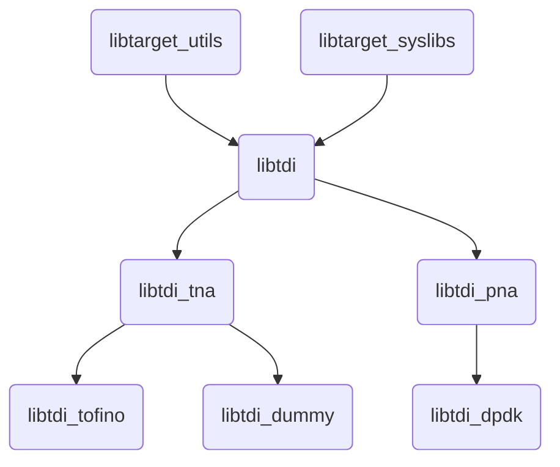

# TDI
## Introduction

TDI (Table Driven Interface) is a Target Abstraction Interface. It is a set of APIs that enable configuration and management of P4 programmable and fixed functions of a backend device in a uniform and dynamic way.

Different targets like bmv2, P4-DPDK can choose to implement their own backends for different P4 and non-P4 objects but can share a common TDI. TDI uses JSON formatted data to describe the tables and other objects of the interface, TDI requires this to be present in a file named tdi.json. This json defines multiple `Table` and `Learn` objects.

## P4 Architecture and its role in TDI

TDI code is divided into 3 layers

* Core : This is the common layer. Code under src directly and code under include/common refers to core code. This includes anything that is not dependent on P4 architecture or target specifications. Match Types - Exact, Ternary, and LPM are all part of the core layer since they are defined by the P4-16 language.
* Arch : The Arch dependent code. This would contain any code that is dependent on the P4 target's architecture. For example, Tofino Native Architecture (TNA) specific code for Idletime attributes, Counters, Registers, etc will have Key and Data handling structures here since the schema for these objects depend upon the arch specifications. Targets may choose to use this code or not to use this code by choice of C++ polymorphism or directly inherit from the top level `tdi::Table` class.
* Target : This code is target dependent. The code under target in this repository will be present solely as an example through a dummy target. Device implementors are expected to have their own backends just like the dummy_target.

## Properties of TDI

All P4 programmable objects and non-P4 programmable objects are realized via "table" structures. A table consists of the below
* Key
* Actions
* Data
* Attributes
* Operations

For a P4 match table

```
    table forward {
        key = {
            hdr.ethernet.dst_addr : exact;
        }
        actions = {
            hit;
            @defaultonly miss;
        }
        const default_action = miss(0x1);
        size = 1024;
    }

```

`tdi.json` structure could look like the below.

```
    {
      "name" : "pipe.SwitchIngress.forward",
      "id" : 37882547,
      "table_type" : "MatchAction_Direct",
      "size" : 1024,
      "has_const_default_action" : true,
      "key" : [
        {
          "id" : 1,
          "name" : "hdr.ethernet.dst_addr",
          "repeated" : false,,
          "match_type" : "Exact",
          "type" : {
            "type" : "bytes",
            "width" : 48
          }
        }
      ],
      "action_specs" : [
        {
          "id" : 32848556,
          "name" : "SwitchIngress.hit",
          "data" : [
            {
              "id" : 1,
              "name" : "port",
              "repeated" : false,
              "type" : {
                "type" : "bytes",
                "width" : 9
              }
            }
          ]
        },
        {
          "id" : 17988458,
          "name" : "SwitchIngress.miss",
          "data" : [
            {
              "id" : 1,
              "name" : "drop",
              "repeated" : false,
              "type" : {
                "type" : "bytes",
                "width" : 3
              }
            }
          ]
        }
      ],
      "data" : [],
      "supported_operations" : [],
      "attributes" : ["EntryScope"]
    },
```
### Key
Key uniquely defines an entry in the table. A key comprises of several "fields". Tables can be present without any Key in their schema. In such a case, only one entry can reside in the table called as the Default entry and the table is called a Keyless table.

### Action
An Action groups together related sets of data fields. At one time, only one action can be active. Tables can be present without any actions too.

### Data
Data fields present outside of any actions are called "common" data. They belong to all actions. 

### Attributes
Attributes are table-wide properties of tables. These define a stateful property of a table, for example, using entry scope attribute in TNA, users can set tables as symmetric or asymmetric and defines the way entries would be programmed in multiple pipeline profiles of a device.

### Operations
Operations are also like Attributes. The only difference is that they are one shot and don't change the properties of a table. For example, counter-sync operation in TNA would sync counter values from hardware to software.

## TDI APIs Overview

### Infrastrcture APIs
APIs to get to a `tdi::Table` object from a `tdi::Device` object

### Metadata APIs
APIs to query any json information like list of key field IDs, Size, type of fields etc.

### Table APIs
CRUD APIs for tables like
* entryAdd
* entryDel
* entryMod
* clear
* entryGet
* entryGetNextN
* entryGetFirst
* defaultEntrySet
* defaultEntryMod
* defaultEntryGet
* usageGet

Object allocate/reset APIs like
* keyAllocate
* dataAllocate
* attributeAllocate
* keyReset

attribute and operations set/get/execute
* tableAttributeSet
* tableAttributeGet
* tableOperationsGet


### Session
Session management API to support batching, transactions
1.  The requests made for a session are guaranteed to be executed in order.
2.  Although multiple threads using single session is supported, it's high discouraged as the resource contention creates serialization of the requests.
3.  A single client thread can make requests on multiple sessions for different resources.


## TDI multiple program and pipeline support

TDI can support managing multiple devices with multiple programs each and with multiple pipeline profiles if the P4 architecture allows.


## Library structure Overview



## Build

```
mkdir -p build && cd build
git submodule update --init --recursive
cmake -DSTANDALONE=ON -DCMAKE_INSTALL_PREFIX=../install .. && make install -j8
```

