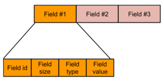

# TDI Specification

Table Driven Interface (TDI) is a runtime control plane specification and a set of APIs that enable the management 
of P4 programmable and non-P4 fixed functions of a backend device in a uniform and dynamic way. 

# Terms and Definitions


|     Terms                      |        Definitions                                         |
| ------------------------------ | ------------------------------------------------------------ |
| BFRT                           | Native C++ and C control plane API, which is the predecessor to TDI. |
| Context.json                   | File generated by P4C backend of target used by TDI frontend and TDI target backend to program the target device pipeline. |
| Fixed Function                 | Non-P4 functionalities (for example, port management and traffic management).|
| MAT                            | Match Action Table                                         |
| P4C                            | P4 Compiler                                                |
| P4Runtime                      | The runtime control plane specification for PSA.           |
| PSA                            | Portable Switch Architecture, a target architecture that describes common capabilities of network switch devices that process and forward packets across multiple interface ports.|
| Programmable Function          | P4 programmable functions.                                 |
| PNA                            | Portable NIC Architecture                                  |
| tdi.json / TDI.json            | File generated by P4C frontend according to TDI schema for use in the runtime control plane.|
| TDI Frontend                   | The frontend layer that implements the TDI APIs and converts them to the form that the TDI target backend expects.|
| TDI Implementation             | TDI backend C++ classes that implement functionalities and the corresponding functionality-specific TDI JSON files.|
| TDI Interface                  | TDI C/C++ API and the TDI parser of the TDI schema.|
| TDI Repo                       | Device independent TDI frontend C/C++ code that is shared by multiple devices.|
| TDI Target Backend             | The target specific backend that configures the target pipeline using the metadata from the context.json.|
| TNA                            | Tofino Native Architecture                                 |

# Introduction to TDI

Table Driven Interface (TDI) is a runtime control plane specification and a set of APIs that enable the management 
of P4 programmable and non-P4 fixed functions of a backend device in a uniform and dynamic way. TDI is a Device Independent (DI) 
interface and has “common code” in one place for devices.   Other manufactures   can use TDI to implement their PSA or any architecture 
(for example, TNA or PNA).

**TDI High Level Design Diagram**


The fixed and the P4 programmable functions use common set of JSON schema that describes all functions as table key and data attributes. 
A uniform API can be used for programming both fixed and P4 programmable functions. Also, the usage of a separate JSON file for defining 
the semantics of the TDI API enables the syntax of the API to be uniform for all target devices and all features. It also enhances the dynamic 
upgradability of the network feature attributes.  

# TDI JSON Workflow

TDI.JSON file acts as a contract between the control plane and frontend. TDI backend is implemented using the context.json file.

**TDI JSON Workflow**


Characteristics of TDI implementation:

*	TDI API header layer provides the common interface for all device capabilities.
*	TDI C++ implementation layer overrides the TDI interface API with the functionality specific C++ methods.
*	Backend functionality managers implement device-specific functionalities. 
*	Backend functionality managers utilize the low-level driver for configuring a device. 

## P4 Programmable Functions

A P4 pipeline program is compiled to generate a set of files (tdi.json and context.json  ) which are used by P4Runtime, TDI library, 
and the target pipeline.  P4Runtime is a gRPC based specification for the management of the P4 device by a controller. The P4Runtime 
client and server use the p4runtime.proto    as the common message format of the P4 program objects. P4Runtime server additionally 
uses the metadata related to the P4 objects from the TDI API to program the TDI API interface.   

Unlike TDI's predecessor (BFRT), p4c generated JSON file contains externs  in table format. The externs of P4Runtime objects from p4info  
needs to be mapped to TDI objects from tdi.json.

**Note**: P4 DPDK TDI feature C++ classes along with the target specific managers, dynamically adjust the mapping to target pipeline by using the context.json file.

##	Non-P4 Fixed Functions

The management of non-P4 fixed functions, like port management or traffic management, is done the similar way using the JSON files. 
The semantics of a fixed function TDI API are defined by a JSON file that defines the table attributes of the fixed function. 
These fixed function JSONs are hand-written.

**Note 1**: You can also generate fixed function JSON from other data models. The fixed function controllers like gRPC-based OpenConfig (gNMI, gNOI) 
use the common messages defined by the YANG models of the fixed function objects. OpenConfig server additionally uses the metadata related to the 
fixed function objects from the TDI API to program the TDI API interface for the message requests. 

**Note 2**: The dynamic update of the fixed function JSON file is possible, but it is not supported in P4 DPDK for now.

The TDI library maps the APIs to the target device configurations. The mapping of fixed function TDI API to backend device configuration is hardcoded. 
You can do such mapping through usage of a file like context.json. 

The P4 programmable and non-P4 fixed function TDI tables follow the same schema, and the organization of the fields are common. 
The following examples show compiler generated tdi.json for a P4 table and hand-written port.json for a port table.

Here is the P4 Table (TDI.JSON from P4C):

```html
"tables" : [
    {
      "id" : 45300881, "name" : "routing_v4",
      "key" : [
        {
          "id" : 1,"name" : "ipv4_dst",
          "match_type" : "LPM"
          "type" : { "type" : "bytes", "width" : "32",}
        }
      ],
      "action_specs" : [
        {
          "id" : 19792090, "name" : "set_next_id",
           "data" : [
             {
              "id" : 1, "name" : "next_id",
              "type" : {"type" : "bytes", "width" : "32",}
             }
          ]
        },
        {
          "id" : 29734112, "name" : "drop",
          "date" : []
        }, ...
```

Here is the Fixed Table (PORT.JSON):

```html
"tables" : [
    {
      "id" : 4278255617, "name" : "$PORT",
      "key" : [{"id" : 1,"name" : "$DEV_PORT",}],
      "data" : [
        {
          "singleton" : {
            "id" : 1, "name" : "$SPEED",
            "type" : {
              "choises" : [
                  "BF_SPEED_1G"
                  "BF_SPEED_10G"
                  ...
                  "BF_SPEED_400G"
                 ]
            }
          }
        },
        {
          "singleton" : {
            "id" : 2, "name" : "$FEC",
            ...
```

# Benefits of TDI  

TDI abstracts all device functionalities as tables with keys and data that are defined solely in JSON files, which help to provide uniform API 
and dynamic upgradability. Uniform interface allows broad adaptation of TDI to different devices. TDI implementation helps avoiding recompilation 
of application code upon changing the P4 program when adding new functionality or features. 

## Uniform Interface

TDI provides a uniform interface for both P4 objects (for example, tables, actions, and action selectors) and non-P4 fixed objects 
(for example, port and QoS nodes). The uniform design concept provides the following capabilities :

*	Programming of all features using a common set of C and C++ APIs as the table keys and defining data through JSON files.
*	The implementation of each feature is hidden behind API thru C++ polymorphism. 
*	The capability of operations supported for each feature table can be learned in uniform manner.
*	TDI C/C++ API is program and protocol independent.    
*	TDI C/C++ API is P4 architecture independent. There are no P4 table or extern names reflected in the TDI API.

## Dynamic Update 

TDI is designed to support dynamic upgrade of feature table semantics. The dynamic update capability provides following capabilities:

*	P4 tables support dynamic update of table keys and data (for example, `SetForwardingPipelineConfig` support) through separating table semantics separated in files. 
*	Through optional use of CONTEXT files, some mapping of TDI user requests target specific configuration can also be dynamically updated. 

# Infrastructure APIs

TDI uses a set of C++ and C table APIs and infrastructure APIs. These APIs are program, protocol, and architecture independent which enable you to 
use them in different platforms.  Infrastructure APIs work with the table APIs to enhance TDI usability. These APIs are not table-driven or JSON-driven.

## TdiInfo

TdiInfo C++ class provides access to the top-level metadata extracted from all JSON files. During the TDI initialization, 
all the JSON files are read by the TDI library, and the metadata for all tables is maintained in the TDI library. 
This includes both P4 and fixed function files. All the table objects of the device can be accessed through the TdiInfo class. 

The TdiInfo class provides access to information such as number of tables, name to/from ID mapping of objects in JSON files, 
and table dependency information. For example, a control plane can access the supported port attributes extracted from the 
consumed port.json file using the `tableFromNameGet` method API.

```html
tdi_status_t TdiInfo::tableFromNameGet(const std::string &name,
                                        const tdi::Table **table_ret) const;
```

For complete list of APIs, refer to the TDI API User Guide.

## TDI Init

TDI Init APIs are used to initialize the TDI library and the target devices using C++ Init, DevMgr, and Device classes. 
TDI API supports multiple devices for each instantiation of TDI library.

**Note**: The existing TDI library for P4 DPDK supports only one device.

### Device Class

Device class represents a target device, which supports a TDI architecture and a list of P4 programs. Device class provides methods 
to create sessions and create targets used in configuring the device. 

~ Begin Proto
Device(const tdi_dev_id_t &device_id,
         const tdi_arch_type_e &arch_type,
         const std::vector<tdi::ProgramConfig> &device_config,
         const std::vector<tdi_mgr_type_e> mgr_type_list,
         void *cookie);
  virtual tdi_status_t Device::createSession( std::shared_ptr<tdi::Session> *session) const;
  virtual tdi_status_t Device::createTarget(std::unique_ptr<tdi::Target> *target) const;
~ End Proto

### Init Class

Init class is used to initialize a TDI library instance with a parameter to customize the features supported by backend managers.

```html
static tdi_status_t tdiModuleInit(
      const std::vector<tdi_mgr_type_e> mgr_type_list);
```

### DevMgr Class

DevMgr class represents management entity of all devices  in a TDI library instance. Using DevMgr, you can add, remove, 
and retrieve the information about the currently added devices.

```html
template <typename T>
  tdi_status_t DevMgr::deviceAdd(const tdi_dev_id_t &device_id,
                         const tdi_arch_type_e &arch_type,
                         const std::vector<tdi::ProgramConfig> &device_config,
                         const std::vector<tdi_mgr_type_e> mgr_type_list,
                         void *cookie);
```

## TDI Target

Target classes represent the device configuration.

### ProgramConfig Class

ProgramConfig class represents a P4 program and a list of P4Pipeline built using the P4 program.  Each P4 program has its own TDI.JSON file.

```html
ProgramConfig(const std::string &prog_name,
                const std::vector<std::string> &tdi_info_file_paths,
                const std::vector<tdi::P4Pipeline> &p4_pipelines)
```


## P4Pipeline Class

A P4Pipeline class represents a P4 program that is mapped onto a target physical pipeline. Each pipeline might have its own context.json, 
pipeline binary file, and the list of physical pipelines it maps onto.  The context.json file is used to map a P4 program to a physical pipeline target. 
The scope vector is used to specify the list of physical pipelines that the P4 tables are shared.  The use of context.json and scope vector is optional.

**Note**: For P4 DPDK, context files are used, and a P4Pipeline is mapped to a single physical pipeline. 

```html
P4Pipeline(const std::string &name,
             const std::string context_path,
             const std::string &binary_path,
             const std::vector<uint32_t> &scope_vec)
```

The fixed function tables are not currently part of P4Pipeline, and the fixed function tables are shared among all P4Pipelines in a device.

**Note**: TDI might support logical fixed function pipeline in future, where a logical fixed function pipeline resources are isolated from other 
logical fixed function pipeline resources.

### Target Class 

Target class represents a configuration target, which is a whole device.

```html
Target(const tdi_dev_id_t &dev_id) : dev_id_(dev_id){};
 Target(const tdi_dev_id_t &dev_id,
         const tdi_pipe_id_t &pipe_id) :
```

### Flags Class

Need to add function of this class.

```html
  Flags(const uint64_t &flags) : flags_(flags){};
  virtual ~Flags() = default;
  tdi_status_t setValue(const tdi_flags_e &flags, const bool &val);
  tdi_status_t getValue(const tdi_flags_e &flags, bool *val) const;
  const uint64_t &getFlags() { return flags_; };
  uint64_t flags_ = 0;
```

## TDI Session

A TDI session supports in-order execution, batching, and atomic transaction of operations by maintaining state between requests. 
Users can control parallelism using sessions.

Characteristics of TDI Session:

*	Requests made in a session are guaranteed to be executed in order.
*	In case of multiple threads on a single session, the order of execution is not guaranteed.
*	A single client thread can make requests on multiple sessions for different resources.

```html
tdi_status_t tdi_session_create(const tdi_device_hdl *device_hdl, tdi_session_hdl **session); 
tdi_status_t tdi_session_destroy(tdi_session_hdl *const session);
```

**Note**: For P4 DPDK, TDI APIs support synchronous response to the API calls.  The synchronous responses to TDI APIs indicate passing of 
resource checking in software, not necessarily programming to hardware .  Asynchronous error events can be sent to a registered client for 
any hardware programming failures.  For now, asynchronous response for the API calls is not supported.  However, asynchronous update for certain 
events from TDI is supported.

### Batching of Operation

The batching API supports batching of multiple requests in a session to maximize processing of requests. By returning the requests with minimal processing, 
batching can be used to achieve higher operation handling rate.

```html
tdi_status_t tdi_begin_batch(tdi_session_hdl *const session);
tdi_status_t tdi_end_batch(tdi_session_hdl *const session, bool hwSynchronous);
```

### Atomic Transaction  of Operation

The transaction APIs support creation of transactions, which would pre-allocate resources prior to committing and commit atomically.

**Note**: For P4 DPDK target, the transaction APIs are not supported currently.

Characteristics of transaction APIs:

* Once a transaction has begun on a session, all other operations on the resources used by the transaction are blocked.
* The verify operation for a transaction is done by verifying resource availability for all resources requested by the transaction.
* The abort operation for a transaction is done by reversing all state and resource allocations associated with the transaction.
* The commit operation for a transaction is done by committing all changes in the transaction to the hardware. 

```html
tdi_status_t tdi_begin_transaction(tdi_session_hdl *const session, bool isAtomic);
tdi_status_t tdi_verify_transaction(tdi_session_hdl *const session);
tdi_status_t tdi_abort_transaction(tdi_session_hdl *const session);
tdi_status_t tdi_commit_transaction(tdi_session_hdl *const session, bool hwSynchronous);
```

## Learn

Learn class supports the notification learn events in the data plane to the control plane. The control plane can register 
callback functions to be notified for different events. The learn API supports the P4 digest event. The digest notifications 
happen as part of a session, and only a single session can be associated with a learn object at a time.

```html
virtual tdi_status_t tdiLearnCallbackRegister(
      const std::shared_ptr<tdi::Session> /*session*/,
      const Target & /*dev_tgt*/,
      const tdiCbFunction & /*callback_fn*/,
      const void * /*cookie*/) const {
    return TDI_SUCCESS;
  };
```

# Table APIs

TDI tables map several P4 concepts to table semantics. These semantics have similar meanings for non-P4 tables as well. 
Each entry in a table comprises of key and data. Key is the entity which identifies the row in the table. 
Data is the columns which make up the table. Each key and data can consist of multiple fields, and the field information comes 
from the JSON files used for a given table.

**Key and Data Representation



A table can or cannot contain **Actions** fields. Actions are self-explanatory in Match Action Tables (MATs), where every data field inside 
an action in the tdi.json represents an action param. In non-MAT tables, `actions` can be used to differentiate between various forms that a data can be formed. 

The C- union construct can be realized using actions

```html
struct table_entry {
	struct data_fields dfs;
	struct key_fields kfs;
};
struct data_fields {
int df1;
int df2;
int df3;
int df4;
union {
	struct action_a1 {
		int a1df1;
		int a1df1;
}a1;
	struct action_a2 {
		int a2df1;
		int a2df1;
		int a2df1;
}a2;
	struct action_a3 {
}a3;
} 
}
struct key_fields {
	int kf1;
int kf2;
}
```

```cpp
Key = {kf1, kf2}
Actions = {
a1 = {a1df1, a1df2},
a2 = {a2df1, a2df2, a2df3},
a3 = {}}
Data = {df1, df2, df3, df4}
```

The above table can be interpreted as follows when it is converted to a model:

*	Key consists of two fields, kf1 and kf2.
*	Three Actions are present.
    *	a1 consists of two data fields.
    *	a2 consists of three data fields.
    *	a3 does not contain any data field (similar to a NoAction action in P4 MATs).
*	Data consists of four data fields (df1, df2, df3, and df4). This is the data directly present on the table, also known as Common Data.

Every table entry should have a (key,data). Key in the above example is straightforward and will always have {kf1, kf2}. 
Data in the above example could have either of the 3 below depending upon the action being used by the entry.

data = {a1df1, a1df2, df1, df2, df3, df4 }

or

data = {a2df1, a2df2, a2df3, df1, df2, df3, df4 }

or 

data = {df1, df2, df3, df4}

If at least one action is present as part of the table structure, every entry should be associated with an action. 
A table structure can choose to not have actions at all and just rely on data fields. 

## Types of TDI Tables and Supported Operations

TDI supports the following types of tables:

* Standard Table: It consists of multiple entries. Each entry has a key and data. It also contains one default entry with data only.

  **Note**: TDI also supports standard table without default entry. It is like standard table, but there are no default entries.

* Const  Table: A table that does not support entryAdd, entryMod, entryDel, defaultEntrySet, defaultEntryMod, and defaultEntryReset. This table type supports only get APIs like entryGet, entryGetFirst, entryGetNextN, usageGet, sizeGet, and defaultEnrtyGet.

  **Note**: TDI also supports const table without default entry. It is like const table, but there are no default entries.

* Keyless Table: A keyless table contains only one entry with data and that becomes the default entry. Only defaultEntryGet, defaultEntrySet, and defaultEntryReset are supported.
* Modify-only Table: N entries always exist. An entryAdd and entryDel are not supported. The entryMod is used to change any value. clear ()  would reset all the entries of the table. There is no default entry associated with this table.

TDI supports the following typical operations on a table:

* Add: Adds an entry with the specified key and data.
* Modify: Modifies an entry with the specified key and data.
* Delete: Deletes an entry with the specified key.
* GetFirst and GetNextN: Gets a range of entries with the specified key.

# TDI JSON Fields

TDI uses two types of JSON files, a p4c compiler generated tdi.json file for P4 programmable functions and hand-written JSON file for fixed functions. 
The fixed and the P4 programmable functions use common set of JSON schema that describes all functions as table key and data attributes. 
The following section explains different JSON fields in the TDI table.

## Table
* name: Name of the table.
* id: ID of the table.
* table_type: Type of table. It is a string mapped to enum internally.
* size: Maximum size of the table.
* annotations: A list of name and value pair. 
* depends_on: ID of another table on which this table depends on. 

  **Note**: Some tables are hard dependent, for example, you cannot delete an entry in the action profile if it is present in a match action table.

* has_const_default_action: Table has a constant default action. It is a boolean value.
* key: Contains multiple key fields. Refer Step [#sec-key]  
* action_specs: Contains action specific data fields. Refer Step [#sec-action_specs]
* data: Contains multiple data fields. Refer Step [#sec-data]
* supported_operations: List of supported operations. Operations are table-wide and help in syncing all entries with hardware. These operations are target specific. 
* attributes: Supported attributes of a table and are table-wide properties.

## Key

Defines the structure of a key for a table entry. It contains multiple fields, and they together form a key. 

**Note**: Some tables are keyless. A keyless table contains only one entry with data and that becomes the default entry. 

Only defaultEntryGet, defaultEntrySet, and defaultEntryReset  APIs are supported in the key field. The key object has following fields:

* id: ID of the key.
* name: Name of the key.
* repeated: The field is repeated or not. If the field is repeated, it becomes an array type.
* annotations: A list of name and value pair.
* mandatory: Provide the key field if the mandatory field is true. If it is not mandatory, then a default value will be used. 
* match_type:
	* Exact: The entire value field is matched.  The data types that support exact are integer, bytes, boolean, and string.
	* Ternary: Value and mask are matched. The supported data type is integer.
	* LPM: Value and prefix length are matched.
* type: Details about type of the key field.
	*  type: If type is “bytes”, define the width field explicitly. Whereas, if the “type” field is any unsigned integer (for example, unit32), you need not define the width.
 	*  width: Represented in bit size. The bit size can be of any value. It does not necessarily need to be byte aligned.
	
## Action_specs

* id: ID of the action.
*  name: Name of the action.
*  action_scope: Indicates whether the action is applicable to table and default, default, or table. In general, actions are always applicable to both table and default.
*  annotations: A list of name and value pair.
*  data: Action-specific data. If there is no action data is not available for an entry, the action considers common data, which is not part of action_spec field.
	*  id: ID of the data.
	*  name: Name of the data.
	*  repeated: The field is repeated or not. If the field is repeated, it becomes an array type. 
	*  mandatory: Refer Step [#sec-data]
	*  read_only: Refer Step [#sec-data]
	*  annotations: A list of name and value pair. 
	*  type: Refer Step [#sec-data]

## Data

There are two types of data fields, action-specific data fields and common data fields. Action-specific data field hold more weightage than common data field. 

A single data field might contain the following fields:

*  mandatory: Provide the data field if the mandatory field is true. If it is not mandatory, then a default value will be used.
*  read_only: For read-only fields, you cannot set the data field using entryAdd.
*  singleton: Contains only one field.
	* id: ID of the field.
	* name: Name of the field.
	* repeated: The field is repeated or not. If the field is repeated, it becomes an array type.
	* annotations: A list of name and value pair.
	* container: A recursive collection of fields. It might contain multiple fields inside it, like C structures. Container holds fields such as mandatory, read-only, and singleton.
	* type: Details about type of the data field.
		* type: Unsigned integer (for example, unit32).
		* choices: This field is displayed only when the “type” is a string.
		* default_value: Values for integer type. If a field is not mandatory, a default value must be there.
* oneof: Contains multiple fields, but only one of those fields can be active at a given time. It consists of id, name, repeated, annotations, and type. 
All the fields of singleton is applicable for oneof also. Refer to singleton fields for more info.
